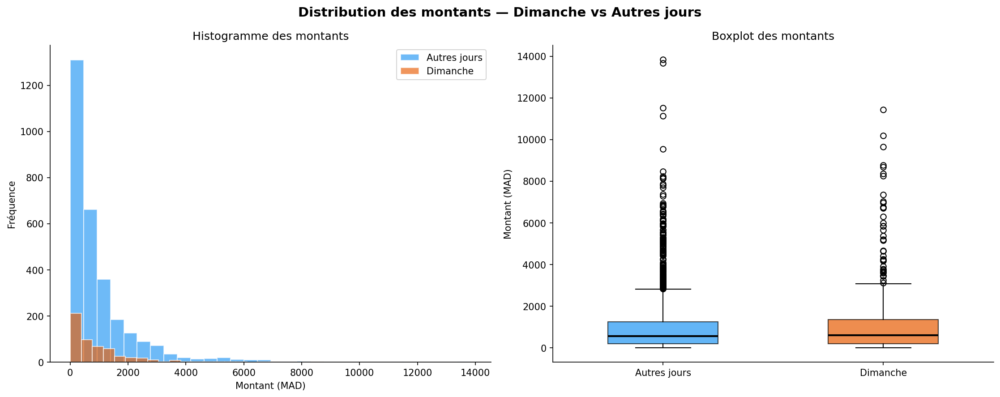

# Lab 03: The "Sunday Effect" — Retail Transaction Analysis

## Overview
This laboratory focuses on exploratory data analysis (EDA) and statistical validation of a retail dataset covering 6 Moroccan cities. The goal was to determine if consumer behavior on Sundays significantly differs from other days of the week.

## Key Technical Tasks
*   **Data Cleaning**: Handled 3,500+ records, managed missing discount data, and normalized payment method labels.
*   **Feature Engineering**: Derived `is_dimanche` temporal flags and calculated net transaction amounts after discounts.
*   **Statistical Analysis**: Comparative analysis of mean and median basket values.
*   **Robustness Testing**: Verified findings across different geographical locations (Casablanca, Rabat, Fes, Agadir, Marrakech, Tangier).

## Analytical Findings
*   **Revenue Concentration**: Identifying that 32% of Sunday revenue is driven by only 3 tech-related products.
*   **The "Premium" Sunday**: Sundays show a **14% increase** in average transaction value, indicating a shift from daily necessities to planned high-value purchases.
*   **Nationwide Trend**: Confirmed that the "Smartphone surge" is a robust national pattern, overperforming in 100% of tested cities.

## Dataset
*   `retail-synthetic-dataset.csv`: Synthetic retail data containing dates, cities, products, prices, and payment methods.

## Visualizations
The analysis produced distribution plots and revenue contribution charts to support the business recommendations.

## Visual Insights
| Distribution Analysis | Revenue Contribution |
| --- | --- |
|  |  |

---
*Developed for the Data Mining Module - Mundiapolis University.*
