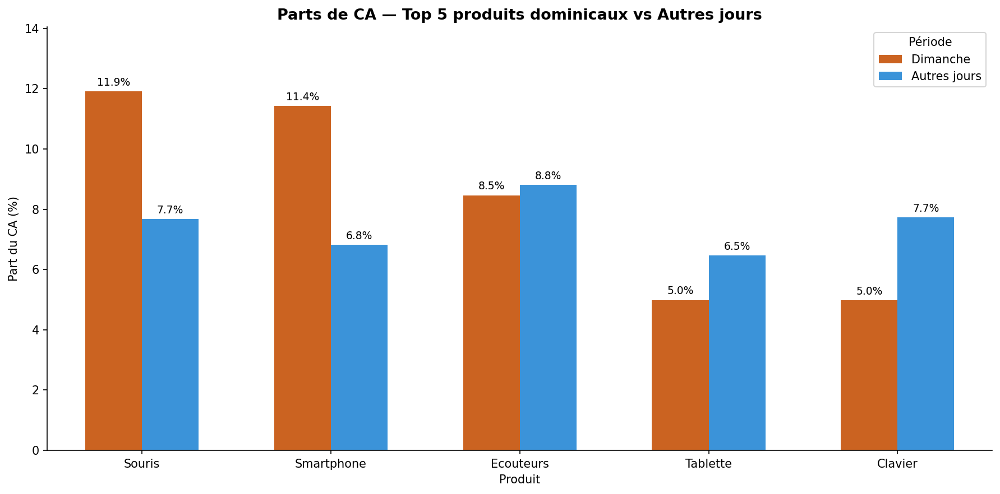

# Lab 03: the "Sunday Effect" retail transaction analysis

This laboratory performs exploratory data analysis (EDA) and statistical
validation of a retail dataset covering six Moroccan cities. The analysis
determines if consumer behavior on Sundays differs significantly from other
days of the week.

## Key technical tasks

- Data cleaning: Processed over 3,500 records, managed missing discount data,
  and normalized payment method labels.
- Feature engineering: Derived temporal flags and calculated net transaction
  amounts after discounts.
- Statistical analysis: Conducted comparative analysis of mean and median
  basket values.
- Robustness testing: Verified findings across geographical locations,
  including Casablanca, Rabat, Fes, Agadir, Marrakech, and Tangier.

## Analytical findings

- Revenue concentration: Identified that 32% of Sunday revenue originates from
  three tech-related products.
- The premium Sunday: Sunday transactions show a 14% increase in average value,
  indicating a shift toward planned high-value purchases.
- National trend: Confirmed the smartphone sales surge as a robust national
  pattern across all tested cities.

## Dataset

- `retail-synthetic-dataset.csv`: Synthetic retail data containing dates,
  cities, products, prices, and payment methods.

## Visualizations

The analysis includes distribution plots and revenue contribution charts to
support business recommendations.

## Visual insights

| Distribution analysis | Revenue contribution |
| --- | --- |
|  |  |

Authored by Youssef Fellah.
Developed for the Engineering Cycle at Mundiapolis University.
